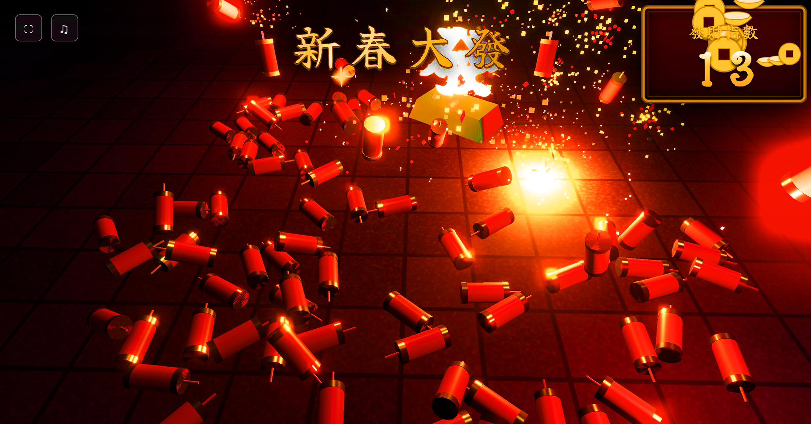
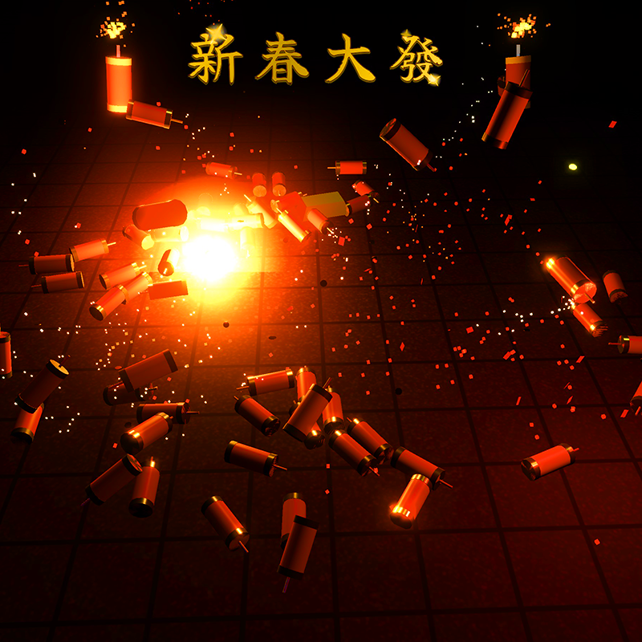
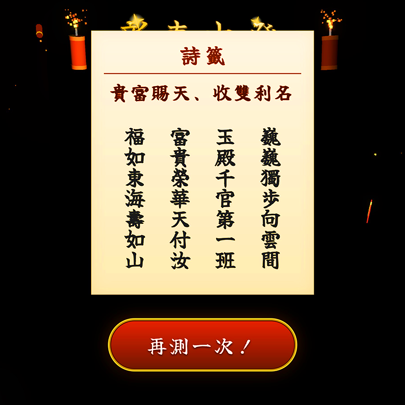

<div align="center">


# 🧨 新春大發 Fortune Blast 🧨


**[ 🇹🇼 中文說明 ](#chinese)** | **[ 🇺🇸 English Version ](#english)**

</div>

---

<a name="chinese"></a>

# 🧨 新春大發

**新春大發 (Fortune Blast)** 是一款專為農曆新年設計的 3D 互動網頁遊戲。使用 **Three.js** 與 **Cannon.js** 開發，體驗真實物理引擎帶來的爽快連鎖爆炸、華麗的粒子特效，以及傳統的求籤系統。

[🔴 **線上試玩**](https://misterp8.github.io/FortuneBlast/)



## ✨ 遊戲特色

* **💥 真實物理連鎖反應**：點燃一根爆竹，引發全場連鎖爆炸！使用 `cannon-es` 模擬真實的碰撞與衝擊力。
* **🎨 華麗視覺特效**：包含客製化粒子系統、泛光 (Bloom) 後處理特效與動態光源，營造熱鬧過年氣氛。
* **📱 響應式與 PWA 支援**：針對手機與電腦最佳化。支援「加入主畫面」功能，可像原生 App 一樣全螢幕遊玩。
* **📜 新春籤詩系統**：遊戲結束後，根據你的「發財指數」求取新年財運籤詩。
* **🔢 文化細節**：貼心的計分系統，會自動跳過傳統不吉利的數字（如 4）。

## 📸 遊戲畫面 

| 💥 連鎖爆炸 | 📜 求籤結果 |
|:---:|:---:|
|  |  |
| *華麗的物理特效* | *獲得新年財運籤詩* |

## 🛠️ 技術堆疊

* **渲染引擎**: [Three.js](https://threejs.org/)
* **物理引擎**: [Cannon-es](https://github.com/pmndrs/cannon-es)
* **後處理**: Three.js EffectComposer (UnrealBloomPass)
* **語言**: Vanilla JavaScript (ES6 Modules)
* **樣式**: CSS3 (RWD 響應式設計, Flexbox)

## 🚀 如何開始 (安裝與執行)

由於本專案使用 ES6 模組，必須透過本地伺服器 (Local Server) 執行，直接打開 `index.html` 會無法運作。

### 1. 下載專案
```bash
git clone [https://github.com/misterp8/FortuneBlast.git](https://github.com/misterp8/FortuneBlast.git)
cd FortuneBlast

```

### 2. 啟動本地伺服器

你可以選擇以下任一種方式：

* **使用 Python:**
```bash
python -m http.server 8000

```


* **使用 Node.js (http-server):**
```bash
npx http-server .

```


* **使用 VS Code:**
安裝 "Live Server" 套件，右鍵點擊 `index.html` 選擇 **"Open with Live Server"**。

### 3. 開啟瀏覽器

前往 `http://localhost:8000` (或終端機顯示的連接埠) 即可開始遊玩。

## 📱 手機版最佳體驗

為了獲得最佳體驗，請依照以下步驟操作：

1. 使用 **Chrome (Android)** 或 **Safari (iOS)** 開啟遊戲網頁。
2. 點選瀏覽器選單中的 **「加到主畫面」** --> **「安裝」**。
3. 從手機桌面點擊圖示開啟，即可享受 **全螢幕沉浸式體驗**。

*恭喜發財 發發發!!* 🧧
---

<a name="english"></a>

# 🧨 Fortune Blast

**Fortune Blast** is a web-based 3D interactive game designed to celebrate the Lunar New Year. Built with **Three.js** and **Cannon.js**, it features satisfying physics-based chain reactions, beautiful particle effects, and a traditional fortune-telling system.

[🔴 **Live Demo**](https://misterp8.github.io/FortuneBlast/)

## ✨ Features

* **💥 Physics-based Chain Reactions**: Ignite one firecracker and watch the chaos unfold! Powered by `cannon-es` for realistic collision and impulse simulation.
* **🎨 Stunning Visual Effects**: Custom shader-based particles, bloom post-processing, and dynamic lighting to create a festive atmosphere.
* **📱 Responsive & PWA Support**: Optimized for both desktop and mobile. Installable as a standalone app on Android/iOS with fullscreen support.
* **📜 Fortune Telling System**: Draws a traditional fortune poem (籤詩) based on your "Prosperity Score" at the end of the game.
* **🔢 Cultural Details**: Smart scoring system that automatically skips taboo numbers (e.g., 4) for good luck.

## 🛠️ Tech Stack

* **Rendering Engine**: [Three.js](https://threejs.org/)
* **Physics Engine**: [Cannon-es](https://github.com/pmndrs/cannon-es)
* **Post-processing**: Three.js EffectComposer (UnrealBloomPass)
* **Language**: Vanilla JavaScript (ES6 Modules)
* **Styling**: CSS3 (Responsive Design, Flexbox)

## 🚀 Getting Started

Since this project uses ES6 modules, you need a local server to run it (directly opening `index.html` won't work due to CORS policy).

### 1. Clone the repository

```bash
git clone [https://github.com/misterp8/FortuneBlast.git](https://github.com/misterp8/FortuneBlast.git)
cd FortuneBlast
```

### 2. Run with a local server

Choose one of the following methods:

* **Using Python:**
```bash
python -m http.server 8000

```


* **Using Node.js (http-server):**
```bash
npx http-server .

```


* **Using VS Code:**
Right-click `index.html` and select **"Open with Live Server"**.

### 3. Open in Browser

Go to `http://localhost:8000` (or the port shown in your terminal).

## 📱 Mobile Experience

For the best experience on mobile devices:

1. Open the game in **Chrome (Android)** or **Safari (iOS)**.
2. Tap **"Add to Home Screen"**.
3. Launch the app from your home screen to enjoy the **Fullscreen Mode**.

---

## 📄 License

This project is licensed under the MIT License - see the [LICENSE](https://www.google.com/search?q=LICENSE) file for details.

*Happy Lunar New Year!* 🧧

## Support ☕

如果您喜歡這個遊戲，歡迎請我喝杯咖啡，支持我持續開發更多有趣的專案！

<a href="https://www.buymeacoffee.com/mister.p">
  
</a>
